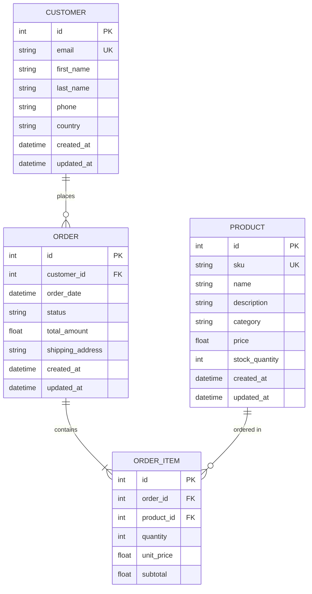

# Model Context Protocol (MCP) - Architecture & Implementation Guide

## Executive Summary

This document details the architectural decisions, design patterns, and implementation strategy for our production-grade MCP server. Written for senior engineers and architects implementing MCP-based systems in enterprise environments.

---

## What is MCP?

**Model Context Protocol (MCP)** is an open protocol that standardizes how applications provide context to Large Language Models (LLMs). It enables:

- **Dynamic context injection**: LLMs access fresh, structured data at inference time rather than relying solely on static training data
- **Tool augmentation**: LLMs can invoke functions/APIs through a standardized interface
- **Separation of concerns**: Clean boundary between LLM capabilities and external data/systems

### MCP vs. Alternatives

| Approach | Context Injection | Standardization | Tool Support | Use Case |
|----------|-------------------|-----------------|--------------|----------|
| **RAG** | Embeddings + Vector DB | Application-specific | Limited | Document Q&A, semantic search |
| **Function Calling** | None | Vendor-specific (OpenAI, Anthropic) | Yes | Single-vendor tool use |
| **MCP** | Structured resources | Open protocol | Yes | Cross-vendor, multi-modal context |

---

## Architecture Overview


### Core Primitives

#### 1. **Resources** (Read-only context)
Structured data that the LLM can reference. Examples:
- Database schema definitions
- API documentation
- File system contents
- Configuration metadata

**Implementation pattern**:
```python
@server.list_resources()
async def list_resources() -> list[Resource]:
    return [
        Resource(
            uri="db://schema/customers",
            name="Customer Table Schema",
            mimeType="application/json",
            description="Schema definition for customers table"
        )
    ]
```

#### 2. **Tools** (Actions/Functions)
Executable operations that modify state or retrieve dynamic data. Examples:
- Execute SQL queries
- Create/update records
- Call external APIs
- Run computations

**Implementation pattern**:
```python
@server.call_tool()
async def call_tool(name: str, arguments: dict) -> list[TextContent]:
    if name == "query_database":
        sql = arguments.get("sql")
        results = execute_sql(sql)  # With safety checks
        return [TextContent(type="text", text=json.dumps(results))]
```

#### 3. **Prompts** (Templates)
Pre-defined prompt templates with variable injection. Examples:
- Common query patterns
- Analysis workflows
- Report generation templates

**Implementation pattern**:
```python
@server.list_prompts()
async def list_prompts() -> list[Prompt]:
    return [
        Prompt(
            name="analyze_customer_orders",
            description="Analyze order patterns for a customer",
            arguments=[
                PromptArgument(name="customer_id", required=True)
            ]
        )
    ]
```

---

## System Flow


---

## Transport Layer

MCP supports three transport mechanisms:

### 1. **stdio** (Standard Input/Output)
- **Use case**: Local processes, CLI tools, development
- **Pros**: Simple, no network overhead, secure
- **Cons**: Single process per server, no load balancing

```python
# Server start
async with stdio_server() as (read_stream, write_stream):
    await server.run(read_stream, write_stream, InitializationOptions(...))
```

### 2. **Server-Sent Events (SSE)**
- **Use case**: Web applications, browser clients
- **Pros**: Works over HTTP, firewall-friendly, streaming support
- **Cons**: Unidirectional (server → client for events)

### 3. **HTTP** (Future)
- **Use case**: RESTful integrations, microservices
- **Pros**: Standard HTTP semantics, load balanceable
- **Cons**: Higher latency than stdio

**Our implementation**: stdio for local development, with architecture ready for SSE in production.

---

## Database Schema Design



### Design Rationale

- **Normalization**: 3NF to avoid data anomalies
- **Indexes**: Composite indexes on common query patterns (`customer_id + order_date`, `category + price`)
- **Audit trails**: `created_at` and `updated_at` on all entities
- **Price snapshot**: `unit_price` in OrderItem preserves pricing at order time
- **Relationships**: Bidirectional with lazy loading control for performance

---

## Security & Safety Considerations

### SQL Injection Prevention
- **Whitelist approach**: Tool validates SQL against allowed patterns
- **Parameter binding**: Use SQLAlchemy parameterized queries
- **Read-only mode**: Option to restrict to SELECT queries only

### Resource Access Control
- **Schema-level filtering**: Expose only non-sensitive tables
- **Column masking**: Redact PII (email, phone) in schema resources
- **Rate limiting**: Throttle tool executions per client

### Error Handling
- **Sanitized errors**: Never expose raw SQL errors to client
- **Structured logging**: All tool calls logged with timestamps
- **Graceful degradation**: Return partial results on timeout

---

## Implementation Roadmap

### Phase 1: Infrastructure (Complete)
- ✅ Project structure and dependency management
- ✅ Database models with SQLAlchemy 2.0
- ✅ Connection pooling and session management
- ✅ Seed data generation for testing

### Phase 2: MCP Server Core (Complete)
- ✅ Server initialization with MCP SDK
- ✅ Resource handlers (schema introspection)
- ✅ Tool handlers (safe query execution)
- ✅ Prompt templates for analytical workflows

### Phase 3: Client & Validation (Complete)
- ✅ MCP client implementation
- ✅ Integration testing framework
- ⏳ Performance benchmarks (in progress)

### Phase 4: Production Hardening (Next)
- ⏳ Enhanced logging and observability
- ⏳ Environment-based configuration
- 🔜 Docker containerization
- 🔜 CI/CD pipeline with GitHub Actions

---

## Performance Considerations

### Connection Pooling
- SQLAlchemy pool configured for 5 base connections + 10 overflow
- Pre-ping enabled to detect stale connections
- Proper session lifecycle (context managers)

### Query Optimization
- Selective eager loading (`selectin` strategy) for relationships
- Composite indexes on high-cardinality columns
- EXPLAIN ANALYZE for query plan validation

### Async Support
- MCP SDK uses `asyncio` for non-blocking I/O
- Database operations wrapped in `asyncio.to_thread()` for sync ORM
- Concurrent tool execution when possible

---

## Testing Strategy

### Unit Tests
- Database models (constraints, relationships)
- Connection manager (pool exhaustion, retry logic)
- Tool validators (SQL safety checks)

### Integration Tests
- End-to-end MCP flows (client → server → database)
- Multi-tool composition scenarios
- Error handling and recovery

### Load Tests
- Concurrent client connections
- Large result set handling
- Memory profiling under load

---

## Monitoring & Observability

### Metrics to Track
- Tool execution latency (p50, p95, p99)
- Database connection pool utilization
- Error rates by tool type
- Client connection duration

### Logging Strategy
```python
logger.info("tool_call", extra={
    "tool_name": name,
    "arguments": arguments,
    "execution_time_ms": elapsed,
    "result_size_bytes": len(result),
    "client_id": client_id
})
```

### Structured Logs
- JSON format for machine parsing
- Correlation IDs across tool calls
- Sensitive data redaction

---

## Extending the System

### Adding New Tools
1. Define tool schema in `tools/` module
2. Implement handler with type validation
3. Add unit tests
4. Update documentation

### Supporting New Databases
1. Add database-specific connection config
2. Implement schema introspection for DB type
3. Test with sample data

### Production Deployment
1. Switch from stdio to SSE transport
2. Add authentication layer (API keys, OAuth)
3. Deploy behind load balancer
4. Enable distributed tracing (OpenTelemetry)

---

## References

- [MCP Specification](https://spec.modelcontextprotocol.io/)
- [MCP Python SDK](https://github.com/modelcontextprotocol/python-sdk)
- [SQLAlchemy 2.0 Documentation](https://docs.sqlalchemy.org/en/20/)
- [Async Python Best Practices](https://docs.python.org/3/library/asyncio.html)

---

**Document Metadata**  
Version: 1.0 | Last Updated: 2026-01-19 | Author: Amit Kumar (@amittian)  
Classification: Technical Reference | Audience: Senior Engineers & Architects
